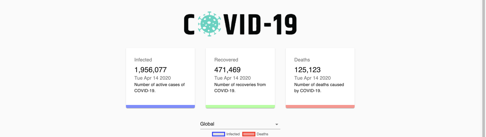
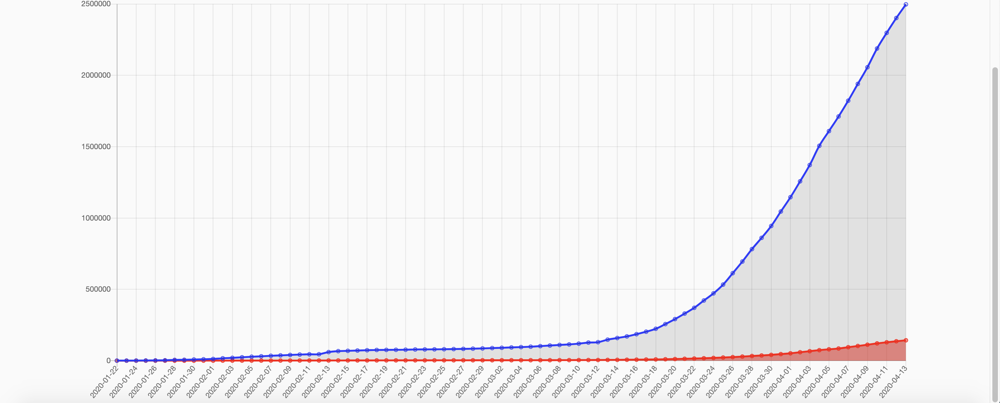

# COVID-19 Tracker

COVID-19 Tracker consumes the API https://covid19.mathdro.id/api to get the latest data regarding infected, recovered, and death cases of COVID-19. A line chart is shown for the global scope and for the individual country scope a bar chart is shown.

## Usage
* Run `npm install`
* Run `npm start`
